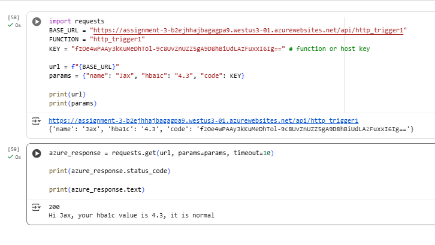
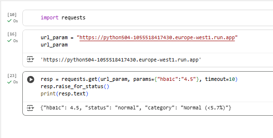
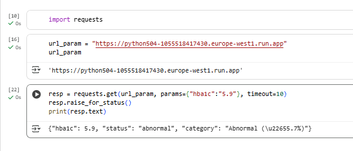

# 504_serverless_functions
Assignment 3

Lab Rule:

The laboratory value that I chose was Hba1c. HbA1c is a blood test that measures the average glucose levels of the blood. If it below 5.7% or in this case 5.7, it is normal. If is is equal to or above 5.7 it is abnormal. According to [medlineplus](https://medlineplus.gov/lab-tests/hemoglobin-a1c-hba1c-test/) anything between 5.7%-6.4% is considered prediabetes, and anything above 6.5% is considered diabetic. I have combined both and labeled them as 'abnormal.' 

Loom: [Recording](https://www.loom.com/share/18eaf555b5c84b319d0c404131071cc8?sid=338c2756-e347-4bfe-b127-6fa461087945)

Azure

Google Cloud: europe-west1  
Public URL: https://python504-1055518417430.europe-west1.run.app

Microsoft Azure: westus3  
Public URL:https://assignment-3-b2ejhhajbagagpa9.westus3-01.azurewebsites.net/api/http_trigger1?code=fzOe4wPAAy3kKuMeDhTol-9c8UvZnUZZ5gA9D8hBiUdLAzFuxxI6Ig==

Comparison  
After using both cloud I enjoyed the simplicity of GCP. It is more flexible and straightforward making it easy to use for beginner. Azure on the other hand feels more powerful. You can see this from their complex security and compliances. One thing I really like about azure is its "test" feature. You can test the python code without going to notebook to see it function something I found to be really helpful. Azure also load and save code faster than that of GCP. Nonetheless, both cloud have its pros and cons, but at the end of the day, get the work done. 