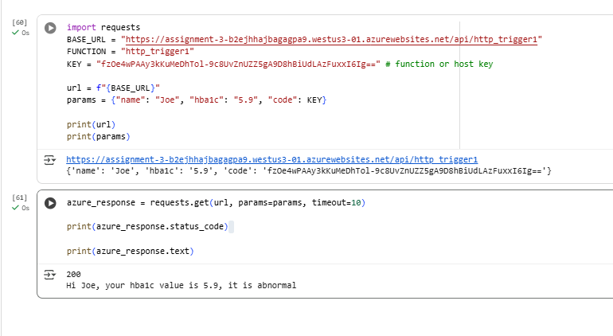

# 504_serverless_functions
Assignment 3

Loom: [Recording](https://www.loom.com/share/18eaf555b5c84b319d0c404131071cc8?sid=338c2756-e347-4bfe-b127-6fa461087945)

Azure

Google Cloud: europe-west1  
Public URL: https://python504-1055518417430.europe-west1.run.app

Microsoft Azure: westus3  
Public URL:https://assignment-3-b2ejhhajbagagpa9.westus3-01.azurewebsites.net/api/http_trigger1?code=fzOe4wPAAy3kKuMeDhTol-9c8UvZnUZZ5gA9D8hBiUdLAzFuxxI6Ig==

Comparison